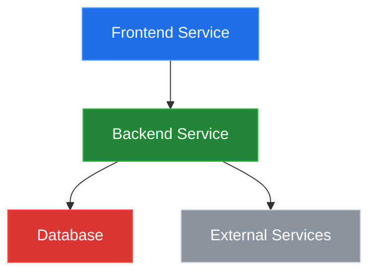

# System Blueprint: suryayalavarthi/n8n

> Auto-generated on 2026-02-12 by Repo-to-Blueprint Architect

## Technical Stack Summary
- Languages: TypeScript, JavaScript, Python
- Frameworks: n8n (Node.js), LangChain, OpenAI
- Databases: Not specified
- Infrastructure: Docker, GitHub Actions, GitHub Container Registry

## Architecture Blueprint


## Logic Sequence
```mermaid
sequenceDiagram
FRONTEND_USER->>FRONTEND: User interacts with UI
FRONTEND->>BACKEND: Send request
BACKEND->>DATABASE: Fetch/store data
BACKEND->>EXTERNAL: Call external APIs
EXTERNAL->>BACKEND: Return data
BACKEND->>FRONTEND: Send response
FRONTEND_USER<<--FRONTEND: Update UI
```

## Architectural Risks
1. Potential vendor lock-in with OpenAI and LangChain: The project heavily relies on OpenAI and LangChain, which could lead to vendor lock-in and make it difficult to migrate to alternative solutions in the future.
2. Complexity of the AI-powered workflow builder: The AI-powered workflow builder is a complex system that integrates various components, including agents, chains, and tools. This complexity could make the system harder to maintain and scale over time.
3. Security and privacy concerns: The project deals with sensitive user data and integrates with external services, which could expose the system to security and privacy risks if not properly addressed.

---

## Deployment Guide
The provided Docker Compose configuration sets up the necessary services for the project, including health checks, volume mapping for persistence, network isolation, and resource limits. The Terraform configuration provisions the required cloud infrastructure, including compute resources, storage, and networking, with configurable parameters.

## Docker Compose
```yaml
version: '3'

services:

  frontend:
    image: ${FRONTEND_IMAGE}:${FRONTEND_TAG}
    ports:
      - ${FRONTEND_PORT}:3000
    healthcheck:
      test: ["CMD", "curl", "-f", "http://localhost:3000/healthz"]
      interval: 30s
      timeout: 10s
      retries: 5
    environment:
      - BACKEND_URL=${BACKEND_URL}
    restart: on-failure

  backend:
    image: ${BACKEND_IMAGE}:${BACKEND_TAG}
    ports:
      - ${BACKEND_PORT}:3000
    healthcheck:
      test: ["CMD", "curl", "-f", "http://localhost:3000/healthz"]
      interval: 30s
      timeout: 10s
      retries: 5
    environment:
      - DB_HOST=${DB_HOST}
      - DB_PORT=${DB_PORT}
      - DB_NAME=${DB_NAME}
      - DB_USER=${DB_USER}
      - DB_PASSWORD=${DB_PASSWORD}
      - OPENAI_API_KEY=${OPENAI_API_KEY}
    restart: on-failure

  database:
    image: postgres:13
    volumes:
      - db-data:/var/lib/postgresql/data
    environment:
      - POSTGRES_DB=${DB_NAME}
      - POSTGRES_USER=${DB_USER}
      - POSTGRES_PASSWORD=${DB_PASSWORD}
    restart: on-failure

volumes:
  db-data:

networks:
  default:
    name: project-network
```

## Terraform
```hcl
provider "aws" {
  region = var.aws_region
}

# VPC
resource "aws_vpc" "main" {
  cidr_block = var.vpc_cidr
}

# Subnets
resource "aws_subnet" "public" {
  vpc_id     = aws_vpc.main.id
  cidr_block = var.public_subnet_cidr
}

# Security Groups
resource "aws_security_group" "frontend" {
  name   = "frontend-sg"
  vpc_id = aws_vpc.main.id

  ingress {
    from_port   = var.frontend_port
    to_port     = var.frontend_port
    protocol    = "tcp"
    cidr_blocks = ["0.0.0.0/0"]
  }
}

resource "aws_security_group" "backend" {
  name   = "backend-sg"
  vpc_id = aws_vpc.main.id

  ingress {
    from_port       = var.backend_port
    to_port         = var.backend_port
    protocol        = "tcp"
    security_groups = [aws_security_group.frontend.id]
  }
}

# EC2 Instances
resource "aws_instance" "frontend" {
  ami           = var.frontend_ami
  instance_type = var.frontend_instance_type
  subnet_id     = aws_subnet.public.id
  vpc_security_group_ids = [aws_security_group.frontend.id]

  tags = {
    Name = "Frontend"
  }
}

resource "aws_instance" "backend" {
  ami           = var.backend_ami
  instance_type = var.backend_instance_type
  subnet_id     = aws_subnet.public.id
  vpc_security_group_ids = [aws_security_group.backend.id]

  tags = {
    Name = "Backend"
  }
}

# RDS Instance
resource "aws_db_instance" "database" {
  engine         = "postgres"
  engine_version = "13.0"
  instance_class = var.db_instance_class
  db_name        = var.db_name
  username       = var.db_username
  password       = var.db_password
  allocated_storage = 20
  vpc_security_group_ids = [aws_security_group.backend.id]
}

# Outputs
output "frontend_url" {
  description = "Frontend service URL"
  value       = "http://${aws_instance.frontend.public_dns}:${var.frontend_port}"
}

output "backend_url" {
  description = "Backend service URL"
  value       = "http://${aws_instance.backend.public_dns}:${var.backend_port}"
}

output "database_endpoint" {
  description = "Database endpoint"
  value       = aws_db_instance.database.endpoint
}
```

---

## Repository Stats
| Metric | Value |
|--------|-------|
| Total Files | 14926 |
| Total Directories | 3728 |
| Generated | 2026-02-12 |
| Source | [suryayalavarthi/n8n](https://github.com/suryayalavarthi/n8n) |

---
*Generated by Repo-to-Blueprint Architect via n8n*
