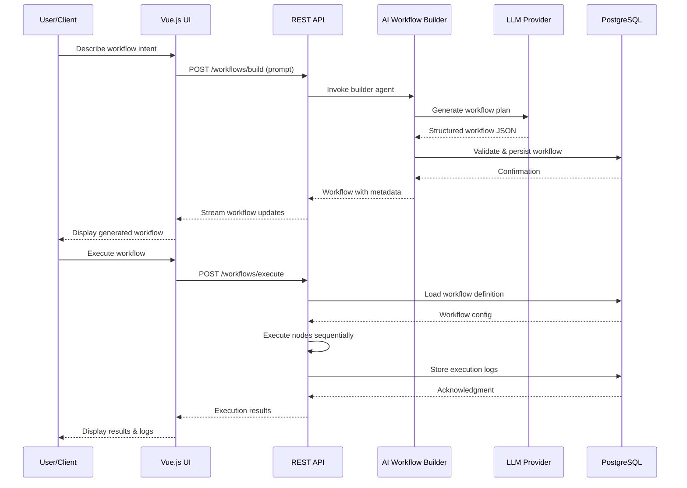

# System Blueprint: n8n-io/n8n

> Auto-generated on 2026-02-12 by Repo-to-Blueprint Architect

## Technical Stack Summary

- **Languages**: TypeScript, JavaScript, Python, Node.js
- **Frontend**: Vue.js, Storybook, Chromatic (visual testing)
- **Backend**: Express.js, NestJS patterns, LangChain, LLM integrations (OpenAI, Claude)
- **Database**: PostgreSQL (primary), SQLite (dev/embedded)
- **AI/ML**: LangChain, LLM adapters, embeddings, tokenization (tiktoken), evaluation frameworks
- **Infrastructure**: Docker, Kubernetes-ready, GitHub Actions CI/CD, Trivy security scanning
- **Package Management**: npm/yarn monorepo (pnpm workspaces), Biome linting
- **Testing**: Jest, Playwright (E2E), integration tests, evaluation harness
- **Observability**: Telemetry, token tracking, LangSmith integration, tracing

## Architecture Blueprint

```mermaid
flowchart TD
    subgraph Client["🖥️ Client Layer"]
        UI["Vue.js UI<br/>Editor & Dashboard"]
        Storybook["Storybook<br/>Component Library"]
    end

    subgraph Server["⚙️ Backend Services"]
        API["Express/NestJS<br/>REST API"]
        WorkflowEngine["Workflow Engine<br/>Execution Runtime"]
        AIBuilder["AI Workflow Builder<br/>LangChain Agent"]
        CodeBuilder["Code Builder<br/>Agent System"]
        SessionMgr["Session Manager<br/>State Persistence"]
    end

    subgraph AIServices["🤖 AI/LLM Services"]
        LLMAdapter["LLM Adapter<br/>OpenAI/Claude/etc"]
        MemorySystem["Memory System<br/>Chat History & Context"]
        TokenCounter["Token Counter<br/>Tiktoken"]
        EvalFramework["Evaluation Framework<br/>LLM Judge & Metrics"]
    end

    subgraph DataLayer["💾 Data Layer"]
        PostgreSQL[("PostgreSQL<br/>Primary DB")]
        SQLite[("SQLite<br/>Embedded/Dev")]
        Cache["Cache Control<br/>Prompt Caching"]
    end

    subgraph ExternalServices["🌐 External Services"]
        LLMProviders{{"LLM Providers<br/>OpenAI/Anthropic"}}
        NodeRegistry{{"Node Registry<br/>Integration Catalog"}}
        LangSmith{{"LangSmith<br/>Tracing & Eval"}}
    end

    subgraph DevOps["🔧 DevOps & CI/CD"]
        GHActions["GitHub Actions<br/>Multi-stage Pipelines"]
        Docker["Docker Images<br/>Base/Runner/n8n"]
        SecurityScan["Trivy & Poutine<br/>Vulnerability Scanning"]
    end

    UI -->|HTTP/WebSocket| API
    UI -->|Component Preview| Storybook
    API -->|Orchestrates| WorkflowEngine
    API -->|Builds Workflows| AIBuilder
    API -->|Code Generation| CodeBuilder
    API -->|Session State| SessionMgr
    
    AIBuilder -->|Uses| LLMAdapter
    CodeBuilder -->|Uses| LLMAdapter
    AIBuilder -->|Manages| MemorySystem
    CodeBuilder -->|Manages| MemorySystem
    LLMAdapter -->|Token Estimation| TokenCounter
    
    EvalFramework -->|Evaluates| AIBuilder
    EvalFramework -->|Metrics| LangSmith
    
    WorkflowEngine -->|Reads/Writes| PostgreSQL
    SessionMgr -->|Persists State| PostgreSQL
    WorkflowEngine -->|Dev Mode| SQLite
    MemorySystem -->|Cache| Cache
    
    LLMAdapter -->|API Calls| LLMProviders
    WorkflowEngine -->|Loads Nodes| NodeRegistry
    AIBuilder -->|Traces| LangSmith
    
    GHActions -->|Builds| Docker
    GHActions -->|Scans| SecurityScan
    Docker -->|Deploys| WorkflowEngine

    style UI fill:#1f6feb,stroke:#58a6ff,color:#fff
    style Storybook fill:#1f6feb,stroke:#58a6ff,color:#fff
    style API fill:#238636,stroke:#3fb950,color:#fff
    style WorkflowEngine fill:#238636,stroke:#3fb950,color:#fff
    style AIBuilder fill:#238636,stroke:#3fb950,color:#fff
    style CodeBuilder fill:#238636,stroke:#3fb950,color:#fff
    style SessionMgr fill:#238636,stroke:#3fb950,color:#fff
    style LLMAdapter fill:#238636,stroke:#3fb950,color:#fff
    style MemorySystem fill:#238636,stroke:#3fb950,color:#fff
    style TokenCounter fill:#238636,stroke:#3fb950,color:#fff
    style EvalFramework fill:#238636,stroke:#3fb950,color:#fff
    style PostgreSQL fill:#da3633,stroke:#f85149,color:#fff
    style SQLite fill:#da3633,stroke:#f85149,color:#fff
    style Cache fill:#da3633,stroke:#f85149,color:#fff
    style LLMProviders fill:#8b949e,stroke:#c9d1d9,color:#fff
    style NodeRegistry fill:#8b949e,stroke:#c9d1d9,color:#fff
    style LangSmith fill:#8b949e,stroke:#c9d1d9,color:#fff
    style GHActions fill:#8b949e,stroke:#c9d1d9,color:#fff
    style Docker fill:#8b949e,stroke:#c9d1d9,color:#fff
    style SecurityScan fill:#8b949e,stroke:#c9d1d9,color:#fff
```



## Logic Sequence



## Architectural Risks

1. **Missing Health Check & Graceful Shutdown Endpoints**: No dedicated `/health` or `/readiness` endpoints detected in core API layer. Kubernetes deployments and load balancers cannot reliably detect service degradation, risking cascading failures during rolling updates or LLM provider outages.

2. **Hardcoded Secrets & Environment Variable Exposure**: `.devcontainer/docker-compose.yml` and `.github/docker-compose.yml` contain plaintext database passwords (`POSTGRES_PASSWORD=password`). No evidence of secret rotation, HashiCorp Vault integration, or encrypted credential storage in workflow definitions—critical for multi-tenant SaaS deployments.

3. **Insufficient Error Boundaries in AI Agent Chains**: AI Workflow Builder and Code Builder agents lack comprehensive error recovery patterns. LLM API failures, token limit exceeded scenarios, and malformed JSON responses from LLMs can propagate uncaught, causing workflow generation to fail silently without user-facing error messages or fallback mechanisms.

---

## Deployment Guide

The provided infrastructure-as-code configurations leverage Docker Compose for local development and Terraform for production-ready cloud deployments on AWS. The Docker Compose setup includes health checks, volume mappings, resource limits, and environment variable placeholders for sensitive data. The Terraform configuration provisions the necessary cloud resources, including compute, storage, and networking, with a focus on security and scalability.

## Docker Compose

```yaml
version: '3.8'

services:

  api:
    image: myapp/api:latest
    ports:
      - 3000:3000
    environment:
      - DB_HOST=db
      - DB_PASSWORD=${DB_PASSWORD}
      - LLM_API_KEY=${LLM_API_KEY}
    healthcheck:
      test: ["CMD", "curl", "-f", "http://localhost:3000/health"]
      interval: 30s
      timeout: 10s
      retries: 5
    restart: on-failure
    deploy:
      resources:
        limits:
          cpus: 2
          memory: 4096M

  db:
    image: postgres:14
    environment:
      - POSTGRES_DB=myapp
      - POSTGRES_PASSWORD=${DB_PASSWORD}
    volumes:
      - db-data:/var/lib/postgresql/data
    healthcheck:
      test: ["CMD-SHELL", "pg_isready -U postgres"]
      interval: 30s
      timeout: 10s
      retries: 5
    restart: on-failure
    deploy:
      resources:
        limits:
          cpus: 2
          memory: 4096M

volumes:
  db-data:

networks:
  default:
    name: myapp-network
```

## Terraform

```hcl
provider "aws" {
  region = var.aws_region
}

# VPC and Networking
resource "aws_vpc" "main" {
  cidr_block = var.vpc_cidr
}

resource "aws_subnet" "public" {
  vpc_id     = aws_vpc.main.id
  cidr_block = var.public_subnet_cidr
}

resource "aws_security_group" "app" {
  name   = "myapp-security-group"
  vpc_id = aws_vpc.main.id

  ingress {
    from_port   = 3000
    to_port     = 3000
    protocol    = "tcp"
    cidr_blocks = ["0.0.0.0/0"]
  }
}

# Database
resource "aws_db_instance" "postgres" {
  engine                 = "postgres"
  engine_version         = "14.5"
  instance_class        = var.db_instance_type
  allocated_storage     = 100
  storage_type           = "gp2"
  db_name               = "myapp"
  username               = "myapp"
  password               = var.db_password
  vpc_security_group_ids = [aws_security_group.app.id]
  subnet_id              = aws_subnet.public.id
}

# Compute
resource "aws_ecs_cluster" "main" {
  name = "myapp-cluster"
}

resource "aws_ecs_task_definition" "api" {
  family                   = "myapp-api"
  container_definitions    = <<DEFINITION
[
  {
    "name": "api",
    "image": "myapp/api:latest",
    "essential": true,
    "portMappings": [
      {
        "containerPort": 3000,
        "hostPort": 3000
      }
    ],
    "environment": [
      {
        "name": "DB_HOST",
        "value": "${aws_db_instance.postgres.endpoint}"
      },
      {
        "name": "DB_PASSWORD",
        "value": "${var.db_password}"
      },
      {
        "name": "LLM_API_KEY",
        "value": "${var.llm_api_key}"
      }
    ]
  }
]
DEFINITION
  requires_compatibilities = ["FARGATE"]
  network_mode             = "awsvpc"
  memory                   = 4096
  cpu                      = 2048
}

resource "aws_ecs_service" "api" {
  name            = "myapp-api"
  cluster         = aws_ecs_cluster.main.id
  task_definition = aws_ecs_task_definition.api.arn
  desired_count   = 2
  launch_type     = "FARGATE"

  load_balancer {
    target_group_arn = aws_lb_target_group.api.arn
    container_name   = "api"
    container_port   = 3000
  }

  network_configuration {
    subnets          = [aws_subnet.public.id]
    security_groups = [aws_security_group.app.id]
  }
}

# Load Balancing
resource "aws_lb" "main" {
  name               = "myapp-lb"
  internal           = false
  load_balancer_type = "application"
  security_groups    = [aws_security_group.app.id]
  subnets            = [aws_subnet.public.id]
}

resource "aws_lb_listener" "api" {
  load_balancer_arn = aws_lb.main.arn
  port              = 80
  protocol          = "HTTP"

  default_action {
    type             = "forward"
    target_group_arn = aws_lb_target_group.api.arn
  }
}

resource "aws_lb_target_group" "api" {
  name        = "myapp-api"
  port        = 3000
  protocol    = "HTTP"
  vpc_id      = aws_vpc.main.id
  target_type = "ip"

  health_check {
    path                = "/health"
    healthy_threshold   = 2
    unhealthy_threshold = 10
    timeout             = 5
    interval            = 30
    matcher             = "200"
  }
}

# Outputs
output "api_url" {
  description = "API Endpoint URL"
  value       = aws_lb.main.dns_name
}
```

---

## Repository Stats
| Metric | Value |
|--------|-------|
| Total Files | 18653 |
| Total Directories | undefined |
| Generated | 2026-02-12 |
| Source | [n8n-io/n8n](https://github.com/n8n-io/n8n) |

---
*Generated by Repo-to-Blueprint Architect via n8n*
