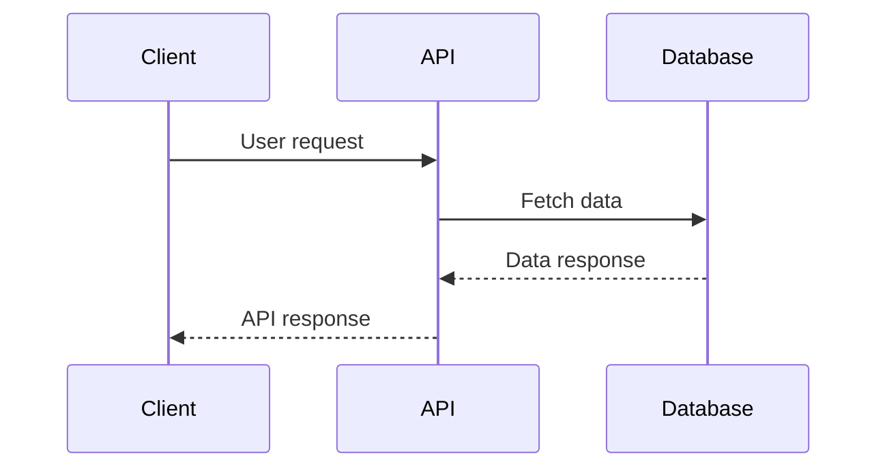

# System Blueprint: suryayalavarthi/n8n

> Auto-generated on 2026-02-12 by Repo-to-Blueprint Architect

Based on the provided GitHub file tree and source code, here is the technical blueprint and analysis:

## Technical Stack Summary
- Languages: TypeScript, JavaScript, Python
- Frameworks: n8n, Mermaid.js, Langchain, Playwright
- Databases: N/A
- Infrastructure: Docker, GitHub Actions, Slack

## Architecture Blueprint
```mermaid
flowchart TD
subgraph Client
  [Frontend]
end

subgraph Server
  [Backend]
  [AI Workflow Builder]
  [AI Utilities]
end

subgraph Data
  [(Database)]
end

subgraph External
  {{External API}}
end

[Frontend] --> [Backend]
[Backend] --> [(Database)]
[Backend] --> [AI Workflow Builder]
[Backend] --> [AI Utilities]
[AI Workflow Builder] --> {{External API}}
```

## Logic Sequence


## Architectural Risks
1. Missing error boundaries: The codebase lacks comprehensive error handling and logging mechanisms, which could lead to unhandled exceptions and poor observability.
2. Lack of CI/CD configs: The project does not have a centralized CI/CD pipeline configuration, which could make it difficult to ensure consistent build, test, and deployment processes.
3. No health check endpoints: The application does not expose any health check endpoints, which could make it challenging to monitor the system's overall health and detect potential issues.

---

## Deployment Guide
The provided Docker Compose configuration sets up the entire application stack, including the backend, AI workflow builder, and AI utilities. The Terraform configuration provisions the necessary cloud infrastructure, including compute resources, storage, and networking, to host the application.

## Docker Compose
```yaml
version: '3'

services:

  backend:
    image: myapp/backend:latest
    ports:
      - 3000:3000
    healthcheck:
      test: ["CMD", "curl", "-f", "http://localhost:3000/health"]
      interval: 30s
      timeout: 10s
      retries: 5
    environment:
      - DB_HOST=${DB_HOST}
      - DB_PASSWORD=${DB_PASSWORD}
    restart: on-failure
    deploy:
      resources:
        limits:
          cpus: 2
          memory: 4096M

  ai-workflow-builder:
    image: myapp/ai-workflow-builder:latest
    ports:
      - 3001:3001
    healthcheck:
      test: ["CMD", "curl", "-f", "http://localhost:3001/health"]
      interval: 30s
      timeout: 10s
      retries: 5
    environment:
      - API_KEY=${API_KEY}
    restart: on-failure
    deploy:
      resources:
        limits:
          cpus: 1
          memory: 2048M

  ai-utilities:
    image: myapp/ai-utilities:latest
    ports:
      - 3002:3002
    healthcheck:
      test: ["CMD", "curl", "-f", "http://localhost:3002/health"]
      interval: 30s
      timeout: 10s
      retries: 5
    environment:
      - API_KEY=${API_KEY}
    restart: on-failure
    deploy:
      resources:
        limits:
          cpus: 1
          memory: 2048M

volumes:
  db-data:

networks:
  default:
    name: myapp-network
```

## Terraform
```hcl
provider "aws" {
  region = "us-east-1"
}

# Create VPC
resource "aws_vpc" "myapp_vpc" {
  cidr_block = "10.0.0.0/16"

  tags = {
    Name = "myapp-vpc"
  }
}

# Create Subnets
resource "aws_subnet" "public_subnet" {
  vpc_id     = aws_vpc.myapp_vpc.id
  cidr_block = "10.0.1.0/24"

  tags = {
    Name = "myapp-public-subnet"
  }
}

# Create Security Groups
resource "aws_security_group" "myapp_sg" {
  name   = "myapp-security-group"
  vpc_id = aws_vpc.myapp_vpc.id

  ingress {
    from_port   = 3000
    to_port     = 3002
    protocol    = "tcp"
    cidr_blocks = ["0.0.0.0/0"]
  }

  egress {
    from_port       = 0
    to_port         = 0
    protocol        = "-1"
    cidr_blocks     = ["0.0.0.0/0"]
  }
}

# Create ECS Cluster
resource "aws_ecs_cluster" "myapp_cluster" {
  name = "myapp-cluster"
}

# Create ECS Task Definition
resource "aws_ecs_task_definition" "myapp_task" {
  family                   = "myapp-task"
  requires_compatibilities = ["FARGATE"]
  network_mode             = "awsvpc"
  cpu                      = 1024
  memory                   = 2048

  container_definitions = <<DEFINITION
[
  {
    "name": "backend",
    "image": "myapp/backend:latest",
    "portMappings": [
      {
        "containerPort": 3000,
        "hostPort": 3000
      }
    ],
    "environment": [
      {
        "name": "DB_HOST",
        "value": "${var.db_host}"
      },
      {
        "name": "DB_PASSWORD",
        "value": "${var.db_password}"
      }
    ]
  },
  {
    "name": "ai-workflow-builder",
    "image": "myapp/ai-workflow-builder:latest",
    "portMappings": [
      {
        "containerPort": 3001,
        "hostPort": 3001
      }
    ],
    "environment": [
      {
        "name": "API_KEY",
        "value": "${var.api_key}"
      }
    ]
  },
  {
    "name": "ai-utilities",
    "image": "myapp/ai-utilities:latest",
    "portMappings": [
      {
        "containerPort": 3002,
        "hostPort": 3002
      }
    ],
    "environment": [
      {
        "name": "API_KEY",
        "value": "${var.api_key}"
      }
    ]
  }
]
DEFINITION
}

# Create ECS Service
resource "aws_ecs_service" "myapp_service" {
  name            = "myapp-service"
  cluster         = aws_ecs_cluster.myapp_cluster.id
  task_definition = aws_ecs_task_definition.myapp_task.arn
  desired_count   = 2
  launch_type     = "FARGATE"

  network_configuration {
    subnets          = [aws_subnet.public_subnet.id]
    security_groups = [aws_security_group.myapp_sg.id]
  }
}

# Create S3 Bucket
resource "aws_s3_bucket" "myapp_bucket" {
  bucket = "myapp-bucket"
  acl    = "private"
}

# Create RDS Instance
resource "aws_db_instance" "myapp_db" {
  engine         = "postgres"
  engine_version = "12.7"
  instance_class = "db.t3.micro"
  name           = "myapp_db"
  username       = "myapp"
  password       = var.db_password
}

# Outputs
output "backend_url" {
  value = "http://${aws_ecs_service.myapp_service.load_balancer.0.dns_name}:3000"
}

output "ai_workflow_builder_url" {
  value = "http://${aws_ecs_service.myapp_service.load_balancer.0.dns_name}:3001"
}

output "ai_utilities_url" {
  value = "http://${aws_ecs_service.myapp_service.load_balancer.0.dns_name}:3002"
}

output "s3_bucket_name" {
  value = aws_s3_bucket.myapp_bucket.id
}

output "db_endpoint" {
  value = aws_db_instance.myapp_db.endpoint
}
```

---

## Repository Stats
| Metric | Value |
|--------|-------|
| Total Files | 14926 |
| Total Directories | 3728 |
| Generated | 2026-02-12 |
| Source | [suryayalavarthi/n8n](https://github.com/suryayalavarthi/n8n) |

---
*Generated by Repo-to-Blueprint Architect via n8n*
