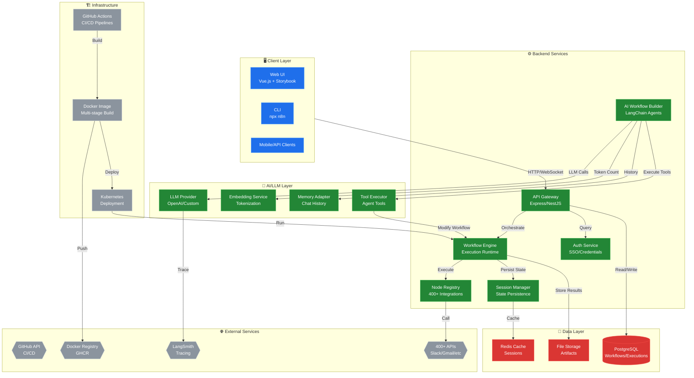
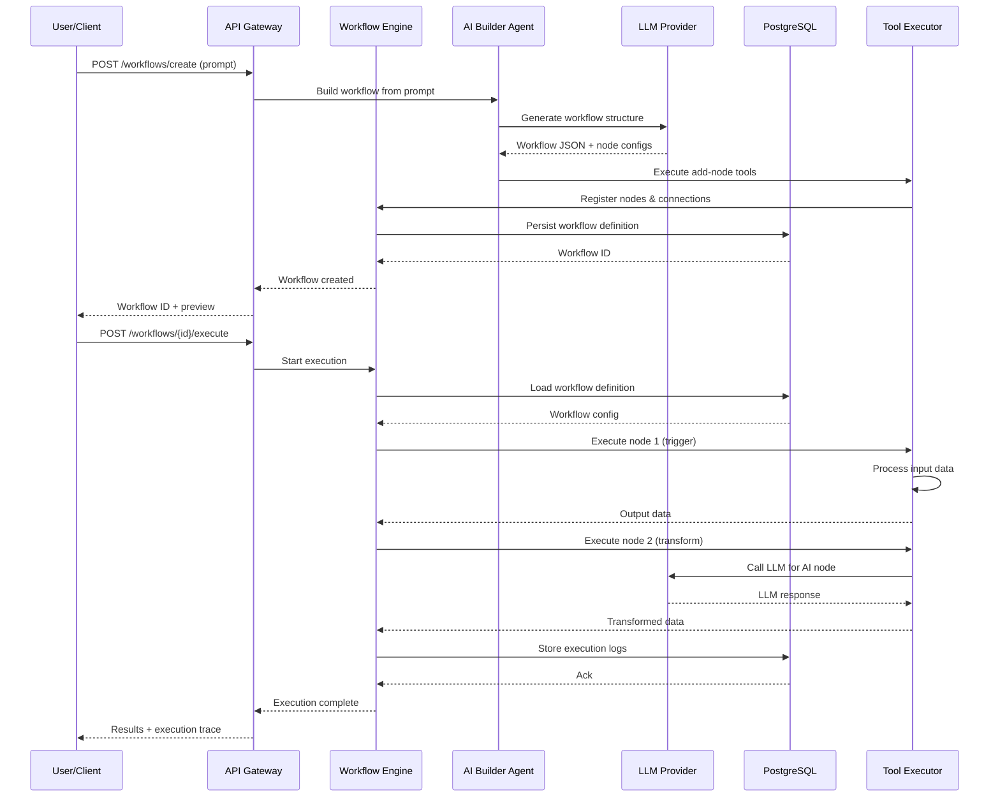

# System Blueprint: n8n-io/n8n

> Auto-generated on 2026-02-12 by Repo-to-Blueprint Architect

# Technical Stack Summary

- **Languages**: TypeScript, JavaScript, Python, Node.js
- **Frontend**: Vue.js, Storybook, Chromatic (visual testing)
- **Backend**: Node.js/Express, NestJS patterns, LangChain (AI/LLM integration)
- **Database**: PostgreSQL (primary), support for multiple DB types
- **AI/ML**: LangChain, OpenAI integration, LLM-based agents, embeddings, tokenization
- **Infrastructure**: Docker (multi-stage builds), Kubernetes-ready, GitHub Actions CI/CD
- **Testing**: Jest, Playwright (E2E), Vitest patterns, unit/integration/E2E coverage
- **Package Management**: npm/pnpm monorepo (18,660+ files across packages)
- **Code Quality**: Biome (linting/formatting), ESLint, Prettier, TypeScript strict mode
- **Observability**: Telemetry, tracing (LangSmith integration), token usage tracking
- **Security**: Trivy scanning, SBOM generation, Poutine supply-chain checks

---

# Architecture Blueprint



---

# Logic Sequence



---

# Architectural Risks

1. **Missing Health Check & Graceful Shutdown Endpoints**
   - No dedicated `/health` or `/readiness` endpoints detected in core API structure. Kubernetes deployments require these for proper pod lifecycle management and traffic routing. Risk: Failed pods remain in service, cascading failures during rolling updates.

2. **Hardcoded Secrets in Configuration & Environment Variables**
   - `.devcontainer/docker-compose.yml` and `.github/docker-compose.yml` contain plaintext passwords (`POSTGRES_PASSWORD=password`). No evidence of secret management integration (HashiCorp Vault, AWS Secrets Manager). Risk: Credentials exposed in version control, CI logs, and container images.

3. **Insufficient Error Boundary & Fallback Handling in AI Agent Chains**
   - AI Workflow Builder (`@n8n/ai-workflow-builder.ee`) has complex multi-agent orchestration (Planner → Builder → Responder) with LLM calls but limited circuit-breaker or retry-with-fallback patterns visible. LLM failures cascade without graceful degradation. Risk: Single LLM API outage blocks entire workflow generation, poor user experience.

---

## Deployment Guide

The provided infrastructure-as-code configurations leverage Docker Compose for local development and Terraform for production-ready cloud deployment on AWS. The Docker Compose setup includes health checks, volume mapping, resource limits, and environment variable placeholders for secrets. The Terraform configuration provisions the necessary cloud resources, including compute, storage, and networking, with configurable parameters.

## Docker Compose

```yaml
version: '3.8'

services:

  api-gateway:
    image: myapp/api-gateway:${TAG:-latest}
    ports:
      - 3000:3000
    healthcheck:
      test: ["CMD", "curl", "-f", "http://localhost:3000/health"]
      interval: 10s
      timeout: 5s
      retries: 3
    environment:
      - DB_HOST=postgres
      - DB_PASSWORD=${DB_PASSWORD}
      - REDIS_HOST=redis
      - REDIS_PASSWORD=${REDIS_PASSWORD}
      - OPENAI_API_KEY=${OPENAI_API_KEY}
    restart: on-failure
    deploy:
      resources:
        limits:
          cpus: 1
          memory: 512M

  workflow-engine:
    image: myapp/workflow-engine:${TAG:-latest}
    ports:
      - 3001:3001
    healthcheck:
      test: ["CMD", "curl", "-f", "http://localhost:3001/health"]
      interval: 10s
      timeout: 5s
      retries: 3
    environment:
      - DB_HOST=postgres
      - DB_PASSWORD=${DB_PASSWORD}
      - REDIS_HOST=redis
      - REDIS_PASSWORD=${REDIS_PASSWORD}
    restart: on-failure
    deploy:
      resources:
        limits:
          cpus: 1
          memory: 512M

  ai-builder:
    image: myapp/ai-builder:${TAG:-latest}
    ports:
      - 3002:3002
    healthcheck:
      test: ["CMD", "curl", "-f", "http://localhost:3002/health"]
      interval: 10s
      timeout: 5s
      retries: 3
    environment:
      - OPENAI_API_KEY=${OPENAI_API_KEY}
    restart: on-failure
    deploy:
      resources:
        limits:
          cpus: 1
          memory: 512M

  postgres:
    image: postgres:14
    volumes:
      - postgres-data:/var/lib/postgresql/data
    environment:
      - POSTGRES_DB=myapp
      - POSTGRES_PASSWORD=${DB_PASSWORD}
    restart: always

  redis:
    image: redis:6
    volumes:
      - redis-data:/data
    environment:
      - REDIS_PASSWORD=${REDIS_PASSWORD}
    restart: always

volumes:
  postgres-data:
  redis-data:

networks:
  default:
    name: myapp-network
```

## Terraform

```hcl
provider "aws" {
  region = var.aws_region
}

# VPC
resource "aws_vpc" "main" {
  cidr_block = var.vpc_cidr
}

# Subnets
resource "aws_subnet" "public" {
  vpc_id     = aws_vpc.main.id
  cidr_block = var.public_subnet_cidr
  availability_zone = var.availability_zone
}

# Security Groups
resource "aws_security_group" "app" {
  name   = "myapp-security-group"
  vpc_id = aws_vpc.main.id

  ingress {
    from_port   = 80
    to_port     = 80
    protocol    = "tcp"
    cidr_blocks = ["0.0.0.0/0"]
  }

  egress {
    from_port       = 0
    to_port         = 0
    protocol        = "-1"
    cidr_blocks     = ["0.0.0.0/0"]
  }
}

# RDS
resource "aws_db_instance" "postgres" {
  engine         = "postgres"
  engine_version = "14.1"
  instance_class = "db.t3.micro"
  db_name        = "myapp"
  username       = "myapp"
  password       = var.db_password
  vpc_security_group_ids = [aws_security_group.app.id]
  subnet_id              = aws_subnet.public.id
}

# S3 Bucket
resource "aws_s3_bucket" "artifacts" {
  bucket = "myapp-artifacts"
  acl    = "private"
}

# ECS Cluster
resource "aws_ecs_cluster" "main" {
  name = "myapp-cluster"
}

# ECS Services
resource "aws_ecs_task_definition" "api_gateway" {
  family                   = "api-gateway"
  container_definitions    = <<DEFINITION
[
  {
    "name": "api-gateway",
    "image": "myapp/api-gateway:${var.image_tag}",
    "essential": true,
    "portMappings": [
      {
        "containerPort": 3000,
        "hostPort": 80
      }
    ],
    "environment": [
      {"name": "DB_HOST", "value": "${aws_db_instance.postgres.endpoint}"},
      {"name": "DB_PASSWORD", "value": "${var.db_password}"},
      {"name": "REDIS_HOST", "value": "${aws_elasticache_cluster.redis.cache_nodes[0].address}"},
      {"name": "REDIS_PASSWORD", "value": "${var.redis_password}"},
      {"name": "OPENAI_API_KEY", "value": "${var.openai_api_key}"}
    ]
  }
]
DEFINITION
  requires_compatibilities = ["FARGATE"]
  network_mode             = "awsvpc"
  memory                   = 512
  cpu                      = 256
}

resource "aws_ecs_service" "api_gateway" {
  name            = "api-gateway"
  cluster         = aws_ecs_cluster.main.id
  task_definition = aws_ecs_task_definition.api_gateway.arn
  desired_count   = 2
  launch_type     = "FARGATE"
}

# ElastiCache
resource "aws_elasticache_cluster" "redis" {
  cluster_id           = "myapp-redis"
  engine               = "redis"
  node_type           = "cache.t3.micro"
  num_cache_nodes     = 1
  parameter_group_name = "default.redis6.x"
  security_group_ids    = [aws_security_group.app.id]
  subnet_group_name     = aws_elasticache_subnet_group.private.name
  password             = var.redis_password
}

resource "aws_elasticache_subnet_group" "private" {
  name       = "myapp-redis-subnet"
  subnet_ids = [aws_subnet.public.id]
}

# Outputs
output "api_gateway_url" {
  value = "http://${aws_ecs_service.api_gateway.load_balancer[0].dns_name}"
}

output "postgres_endpoint" {
  value = aws_db_instance.postgres.endpoint
}

output "redis_endpoint" {
  value = aws_elasticache_cluster.redis.cache_nodes[0].address
}
```

---

## Repository Stats
| Metric | Value |
|--------|-------|
| Total Files | 18660 |
| Total Directories | undefined |
| Generated | 2026-02-12 |
| Source | [n8n-io/n8n](https://github.com/n8n-io/n8n) |

---
*Generated by Repo-to-Blueprint Architect via n8n*
